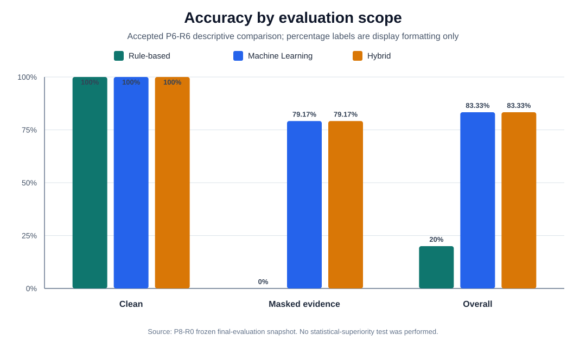
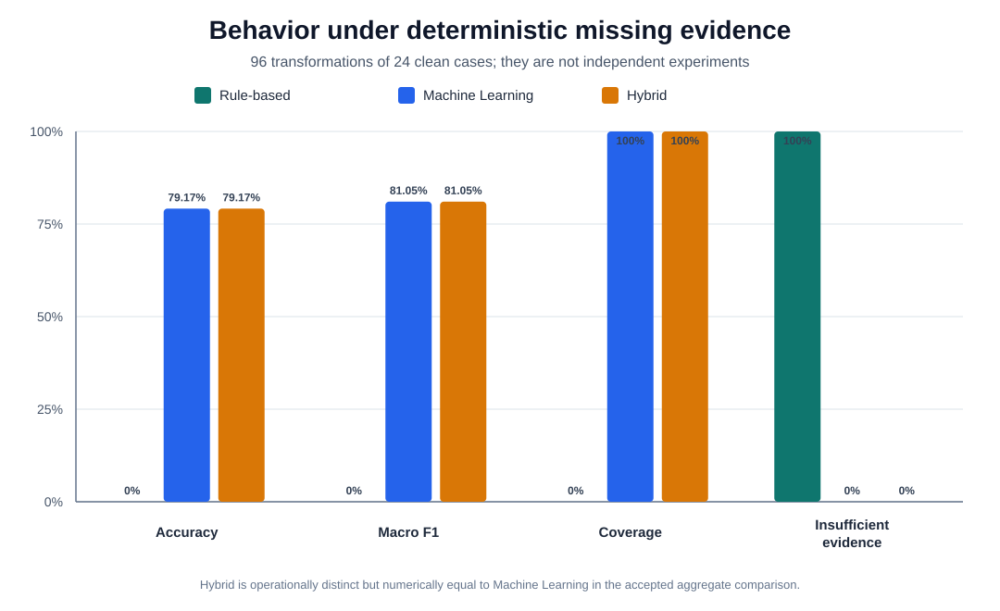

# P8-R2 Thesis-Ready Final Evaluation Synthesis

Date: 2026-08-12

Status: IMPLEMENTED — ACCEPTED VALUES FORMATTED WITHOUT RECOMPUTATION

## 1. Purpose and evidence boundary

P8-R2 resolves the final non-empirical thesis-synthesis gap identified by
D-091. It converts the frozen P8-R0 final-evaluation snapshot into three
thesis-ready tables, two deterministic SVG figures, five bounded findings,
and an explicit claim-to-evidence matrix.

The synthesis is chained fail-closed through D-092. The P8-R0 scope file is
verified against the P8-R1 registry, and the registry is verified against the
tracked private-archive receipt before any output is built. The external
private archive remains the preservation boundary; P8-R2 does not need to
open its runtime members to format the already embedded accepted values.

No Containerlab process, network mutation, diagnosis execution, estimator
deserialization, model refit, policy reselection, test evaluation, metric
recalculation, new metric, or accepted-artifact mutation is performed.

## 2. Final evaluation design

| Design item | Accepted value | Evidence boundary |
| --- | ---: | --- |
| Diagnostic classes | 6 | E04, C02 |
| Complete laboratory contexts | 6 | E04, C02 |
| Final clean dataset rows | 72 | E04, C02 |
| Train / validation / test rows | 36 / 12 / 24 | E04, C02 |
| Clean report-only inputs | 24 | E05, C04 |
| Deterministic masked inputs | 96 | E05, C05 |
| Total comparison inputs per method | 120 | E05, C03 |
| Missing-evidence masks | 4 | E05, C05 |
| Compared methods | 3 | E03, E05, C03 |
| Report-only test attempts | 1 | E05, C08 |

The 96 masked inputs are four deterministic transformations of the 24 clean
test inputs. They are not 96 independent network experiments and must not be
used as an independent-sample basis for population inference.

The exact machine-readable design table is
`docs/thesis_assets/phase8/P8_R2_TABLE_01_EVALUATION_DESIGN.csv`.

## 3. Accepted descriptive comparison

Percentages in this section and the figures are display formatting of the
accepted unit-fraction values. No metric is recalculated. The exact stored
decimals remain in the P8-R0 JSON snapshot and the P8-R2 CSV table.

| Scope | Method | n | Accuracy | Macro-F1 | Coverage | Insufficient evidence |
| --- | --- | ---: | ---: | ---: | ---: | ---: |
| Clean | Rule-based | 24 | 100.00% | 100.00% | 100.00% | 0.00% |
| Clean | Machine Learning | 24 | 100.00% | 100.00% | 100.00% | 0.00% |
| Clean | Hybrid | 24 | 100.00% | 100.00% | 100.00% | 0.00% |
| Masked evidence | Rule-based | 96 | 0.00% | 0.00% | 0.00% | 100.00% |
| Masked evidence | Machine Learning | 96 | 79.17% | 81.05% | 100.00% | 0.00% |
| Masked evidence | Hybrid | 96 | 79.17% | 81.05% | 100.00% | 0.00% |
| Overall | Rule-based | 120 | 20.00% | 33.33% | 20.00% | 80.00% |
| Overall | Machine Learning | 120 | 83.33% | 84.67% | 100.00% | 0.00% |
| Overall | Hybrid | 120 | 83.33% | 84.67% | 100.00% | 0.00% |

The complete exact-value table also preserves exact-diagnosis,
affected-prefix, and abstention rates in
`docs/thesis_assets/phase8/P8_R2_TABLE_02_METHOD_METRICS.csv`.



**Suggested thesis caption — Figure 1.** Accepted descriptive accuracy of the
Rule-based, Machine Learning, and Hybrid methods on clean, deterministic
masked-evidence, and combined inputs. The comparison is limited to the frozen
controlled laboratory test set; no statistical-superiority test was
performed.



**Suggested thesis caption — Figure 2.** Accepted aggregate behavior under
four deterministic missing-evidence masks. The strict Rule-based method fails
closed with insufficient evidence, while Machine Learning and Hybrid retain
full coverage. The masked inputs are transformations of clean cases, not
independent network experiments.

## 4. Bounded interpretation

1. All three methods completely classify the 24 accepted clean test inputs.
   This result is limited to the final controlled contexts and approved
   six-class taxonomy.
2. Under deterministic missing evidence, the strict Rule-based method fails
   closed rather than guessing: masked accuracy, macro-F1, and coverage are
   zero, while the insufficient-evidence rate is one.
3. Machine Learning and Hybrid retain full masked coverage, with accepted
   masked accuracy `0.7916666666666666` and macro-F1
   `0.8104858104858105`.
4. Hybrid is operationally distinct because it records a rule-first,
   Machine-Learning-fallback decision path with provenance. It is numerically
   equal to Machine Learning in every accepted aggregate scope; no Hybrid
   performance advantage is claimed.
5. The final comparison is descriptive only. It records one report-only test
   attempt after the development freeze, without refit, policy reselection,
   or test-guided revision.

## 5. Claim-to-evidence references

| Claim | Evidence | Thesis-safe summary | Required limitation |
| --- | --- | --- | --- |
| C01 | E01, E02, E04 | Controlled end-to-end pipeline from injection through restoration and dataset construction | Local Containerlab contexts and approved single faults only |
| C02 | E04 | Six classes and six contexts with a 36/12/24 whole-context split | Not representative of production networks |
| C03 | E03, E05 | Three methods compared under the same frozen report-only protocol | Descriptive; no statistical-superiority test |
| C04 | E05 | Complete fault-type classification on 24 clean inputs | No claim outside the controlled taxonomy and contexts |
| C05 | E05 | Rule-based fails closed under masks; ML and Hybrid retain coverage and non-zero accuracy | Masked inputs are not independent experiments |
| C06 | E03, E05 | Hybrid has rule-first/fallback provenance | Aggregate metrics equal ML; no superiority claim |
| C07 | E05, E06 | Accepted results are inspectable through the local read-only interface | Not live diagnosis, production NMS, or remote deployment |
| C08 | E05 | Frozen roles and one report-only attempt without refit or test-guided revision | Protocol integrity, not external replication |

The full statements, source paths, and limitation text are preserved in
`docs/thesis_assets/phase8/P8_R2_TABLE_03_CLAIM_EVIDENCE.csv`.

## 6. Claims that remain prohibited

P8-R2 does not authorize any claim that:

- Hybrid statistically outperforms Machine Learning or Rule-based diagnosis;
- the metrics generalize to unseen production networks;
- the 96 masks are independent experimental samples;
- simultaneous multiple faults are diagnosed;
- OSPF or arbitrary dynamic-routing failures are supported;
- the Dashboard performs live inference, remediation, or production
  monitoring;
- confidence values are statistically calibrated; or
- population-level statistical significance has been established.

## 7. Reproducibility and presentation use

`src/phase8/synthesis.py` deterministically rebuilds all CSV and SVG bytes from
the tracked, hash-verified P8-R0/P8-R1 boundary. The generated manifest records
the path, size, and SHA-256 of every thesis asset. SVG files contain no script
or external resource reference and can be used directly or converted to a
print format during Phase 9 without changing their underlying data.

The following command verifies that the tracked synthesis and every generated
asset still match the accepted inputs:

```bash
python -m src.phase8.synthesis --repository-root . --verify
```

P8-R2 closes the thesis-ready synthesis gap only. P8-R3 is next and must
perform the final Phase 8 acceptance and handoff to Phase 9 without expanding
the frozen claim or experimental scope.
